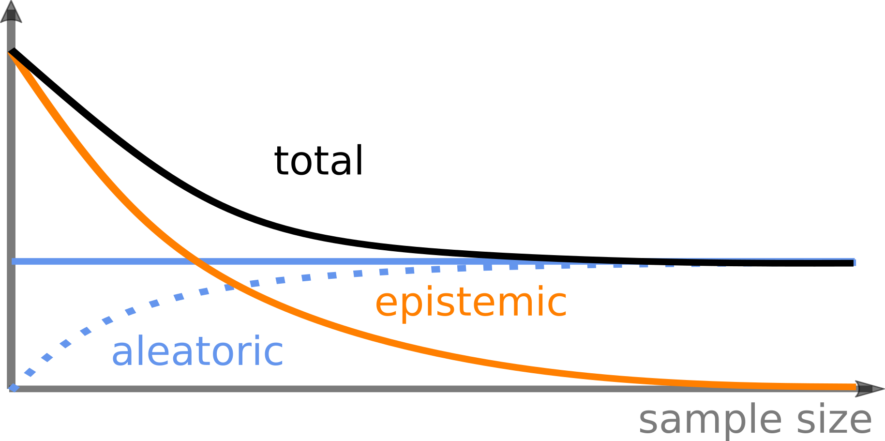

# Entropy-based uncertainty quantification



## Publication

This repository contains the experiment code required to generate the results 
presented in our paper [accepted at UAI2023](https://proceedings.mlr.press/v216/wimmer23a.html):

```
L. Wimmer, Y. Sale, P. Hofman, B. Bischl & E. Hüllermeier:

"Quantifying Aleatoric and Epistemic Uncertainty in Machine Learning:
Are Conditional Entropy and Mutual Information Appropriate Measures?"
```

## Code

### Set-up

The package requirements are listed in `environment.yml`.
A full Python environment can be created from this file using, e.g., `conda`
(`conda env create -f environment.yml`).

### Training & evaluation

The experiments in both `train.py` (computer vision examples) and 
`train_tabular.py` (tabular classification task) can be run from the command 
line interface (CLI). 
For convenience, CLI options can be specified in the respective bash files 
`run_experiment.sh` and `run_experiment_tabular.sh`.

Analogously, the evaluation in `eval.py`, which will produce `.csv` files with 
experiment results, can be triggered from the CLI via
`run_eval.sh`.
